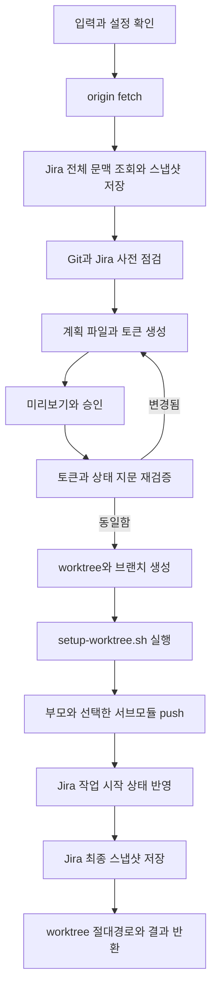
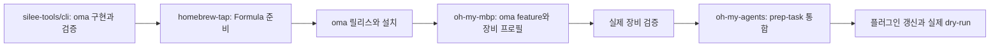

# oma prep 명령 설계

## 한 줄 정의

`oma`는 에이전트 작업을 준비하는 보조 CLI이며, `oma prep`은 Jira 문맥을 읽고
검증 가능한 계획을 만든 뒤 Git worktree, 브랜치, 원격 브랜치와 Jira 작업 시작
상태를 일관된 순서로 준비한다.

## 목표

- 사람과 에이전트가 하나의 결정론적 실행 경로를 공유한다.
- 실제 변경 전에 Jira와 Git 변경 내용을 완전하게 미리 보여준다.
- 승인한 계획과 실제 적용할 계획이 다르면 변경하지 않는다.
- 부분 실패 뒤 같은 명령을 다시 실행해 완료된 단계를 재사용하고 나머지를
  이어서 수행한다.
- Jira 문맥을 로컬에 안전하게 저장해 새 worktree와 에이전트 세션에서 다시
  조회하지 않고 참조할 수 있게 한다.

## 비목표

- Codex나 Claude 세션 자체를 다른 worktree로 이동하지 않는다.
- 기존 worktree를 제거하거나 정리하지 않는다.
- Jira 티켓을 생성하거나 완료 상태로 전환하지 않는다.
- 원격 브랜치를 강제로 덮어쓰지 않는다.
- 여러 에이전트 제품의 SDK나 모델 호출에 의존하지 않는다.
- `prep` 이외의 작업 자동화 하위 명령을 미리 만들지 않는다.

## 명령 구조

`oma`는 첫 범위에서 `prep`, 도움말, 버전 출력만 제공한다.

```text
oma
├── prep
├── help
└── version
```

기본 호출은 다음과 같다.

```sh
oma prep <JIRA-KEY>
```

### 옵션

| 옵션 | 계약 |
| --- | --- |
| `--repo <path>` | 생략하면 현재 디렉터리가 속한 Git 저장소를 사용한다. |
| `--type <type>` | 브랜치 type이며 기본값은 `feature`다. |
| `--base <branch>` | 대화형 기본값은 원격 기본 브랜치다. 비대화형 실행에서는 필수다. |
| `--worktree <mode-or-path>` | 기본값은 `new`다. `current` 또는 등록된 기존 worktree 경로를 받을 수 있다. |
| `--submodule <path>` | 같은 브랜치를 만들 서브모듈 경로다. 여러 번 지정할 수 있다. |
| `--setup-arg <value>` | `scripts/setup-worktree.sh`에 전달할 인자다. 여러 번 지정할 수 있다. |
| `--product-type <config-key>` | Jira 필수 Product type을 로컬 설정의 키로 지정한다. |
| `--no-push` | 원격 브랜치 생성을 명시적으로 생략한다. |
| `--dry-run` | Git·Jira 쓰기 없이 계획과 계획 토큰을 반환한다. |
| `--plan <token>` | 사용자가 승인한 계획을 지정한다. |
| `--yes` | 비대화형 적용을 승인한다. |
| `--json` | stdout에 기계가 읽는 JSON 문서 하나를 출력한다. |

사람이 실행하면 누락된 선택값을 질문하고 변경 내용을 보여준 뒤 적용 승인을
받는다. 비대화형 실행은 필요한 값을 옵션으로 받고, 실제 변경에는 `--plan`과
`--yes`를 모두 요구한다. `--json`은 출력 형식만 바꾸며 변경 승인으로 해석하지
않는다.

## 저장소와 기준 브랜치

`--repo`가 없으면 `git rev-parse --show-toplevel`로 현재 디렉터리의 저장소를
찾는다. Git 저장소 밖에서는 경로를 추측하지 않고 실패한다. `--repo`가 있으면
그 경로가 속한 저장소를 같은 방식으로 정규화한다.

계획을 만들기 전에 원격이 있으면 `git fetch origin`을 실행하고 `--prune`은
실행하지 않는다. 대화형 후보는 원격 기본 브랜치, 현재 브랜치, `hotfix/*`,
`change/*`, `release/*`, 직접 입력 순서로 구성한다. 원격 기본 브랜치를 찾지
못하면 로컬 `main`, 로컬 `master`, 현재 HEAD 순서로 기본값을 찾는다. 비대화형
실행은 `--base`를 요구하며 선택한 ref와 SHA를 계획 상태 지문에 포함한다.

## 브랜치와 worktree 이름

Jira 키는 대문자로 정규화한다. 제목은 Unicode NFC로 정규화하고 한글, 영문,
숫자는 유지한다. 공백과 구분 문자는 `-`로 바꾸고 emoji와 Git ref 금지 문자는
제거한다. 연속된 `-`는 하나로 합치고 양끝의 `-`를 제거한다. 설명 부분은 Unicode
문자 50개로 제한한다. type은 `^[a-z][a-z0-9-]*$` 형식만 허용하고, 정규화한
제목이 비면 계획을 만들지 않는다.

예를 들어 `ABC-1234`의 제목이 `결제 완료 후 영수증이 표시되지 않음`이고 type이
`feature`이면 브랜치는
`feature/ABC-1234-결제-완료-후-영수증이-표시되지-않음`, worktree는
`<repo>/.worktrees/abc-1234-결제-완료-후-영수증이-표시되지-않음`이 된다.

새 worktree 경로가 `git check-ignore`에서 ignore 대상으로 확인되지 않으면 계획
단계에서 실패한다. 동일한 경로와 브랜치가 이미 등록돼 있으면 재사용한다. 둘 중
하나만 일치하거나 경로가 일반 디렉터리로 존재하면 충돌로 처리한다.

CLI는 생성된 worktree 절대경로를 반환한다. 터미널 셸과 에이전트 스킬이 그
경로로 이동할 책임을 가진다.

## 로컬 설정과 상태

XDG Base Directory 역할에 따라 데이터를 나눈다.

| 데이터 | 경로 | 권한 |
| --- | --- | --- |
| 설정 정본 | `${XDG_CONFIG_HOME:-$HOME/.config}/oma/config.toml` | 파일 `0600` |
| 호환 설정 경로 | `${XDG_CONFIG_HOME:-$HOME/.config}/prep-task/config.toml` | 설정 정본을 가리키는 심볼릭 링크 |
| Jira 최신 스냅샷 | `${XDG_CACHE_HOME:-$HOME/.cache}/oma/jira/<host>/<KEY>.json` | 디렉터리 `0700`, 파일 `0600` |
| 승인 대기 계획 | `${XDG_STATE_HOME:-$HOME/.local/state}/oma/plans/<token>.json` | 디렉터리 `0700`, 파일 `0600` |

설정 정본이 없고 호환 경로에 일반 파일이 있으면 변경 전후 구조를 보여주고
승인을 받는다. TOML과 필수 키를 검증한 뒤 새 정본을 `0600` 권한으로 원자적으로
만들고 Jira 인증을 확인한다. 마지막에 기존 파일을 새 정본의 심볼릭 링크로
교체하며, 어느 단계든 실패하면 기존 파일을 복원한다.

계획 단계는 호환 경로의 일반 파일을 읽기만 하고 마이그레이션을 계획에 포함한다.
실제 마이그레이션은 승인된 적용에서 가장 먼저 수행하므로 실패해도 Git이나 Jira
변경이 남지 않는다.

설정 파일에는 Jira 호스트와 프로젝트별 필드 좌표만 둔다. Jira API 자격은
`~/.netrc`에서 읽으며 설정, 계획, 로그, JSON 출력에 복제하지 않는다.

Jira 스냅샷은 실행할 때마다 필요한 이슈 필드를 한 번에 다시 받아 원자적으로
교체한다. 상태 변경 뒤 최종 이슈를 다시 조회해 같은 스냅샷을 확정한다. 이 파일은
네트워크 호출을 생략하기 위한 TTL 캐시가 아니라 새 작업 세션에 최신 문맥을
전달하는 로컬 스냅샷이다.

## 계획과 승인

계획 토큰은 암호학적으로 안전한 난수이며 Jira 본문이나 자격을 포함하지 않는다.
계획 파일은 30분 동안 유효하고 한 번만 사용할 수 있다. 적용을 시작할 때 계획을
원자적으로 사용 중 상태로 바꿔 두 프로세스가 같은 토큰을 동시에 쓰지 못하게
한다. 성공 여부와 관계없이 적용을 시도한 토큰은 소비한다.

`--dry-run`은 worktree, 브랜치, push와 Jira 필드를 바꾸지 않는다. 최신 계획을
만들기 위한 `git fetch origin`, Jira 스냅샷 교체와 계획 파일 생성은 수행하며
미리보기에서 이 로컬 운영 상태 변경을 구분해 알린다.

계획 상태 지문에는 정규화된 저장소 경로와 Git common directory, base ref와 SHA,
Jira 호스트·티켓 키·상태·담당자·시작일, 브랜치·worktree·원격 브랜치 상태,
서브모듈과 각 base SHA, 셋업 스크립트 해시와 인자, push와 Jira 변경 옵션을
포함한다.

토큰이 만료되거나 상태 지문이 달라지면 아무 변경도 하지 않는다. 현재 상태로 새
계획과 새 토큰을 만들어 다시 승인받는다.

## 적용 순서



저장소 루트에 `scripts/setup-worktree.sh`가 있을 때만 새 worktree에서 실행한다.
CLI는 다른 임의 명령을 받지 않는다. 셋업 실패 시 push와 Jira 변경을 수행하지
않고 worktree를 남긴다.

`origin`이 있으면 push 성공을 Jira 변경의 필수 게이트로 둔다. 원격이 없거나
`--no-push`가 명시된 경우에는 결과에 생략 사실을 기록한다. 부모 저장소와 선택한
서브모듈을 모두 push한 뒤에만 Jira 변경을 시작한다.

## Jira 변경 정책

- 티켓이 이미 진행 중 범주이면 상태 전환을 생략한다.
- 완료 범주의 티켓은 자동으로 이전 상태로 되돌리지 않는다.
- 담당자가 비어 있으면 현재 Jira 사용자로 채우고, 값이 있으면 보존한다.
- 시작일이 비어 있으면 로컬 달력의 오늘 날짜로 채우고, 값이 있으면 보존한다.
- 진행 중 범주까지 최대 3단계 전환만 허용한다.
- 완료 범주로 향하는 전환은 자동으로 선택하지 않는다.
- Product type 같은 필수 선택 필드가 비어 있으면 설정의 후보 중 하나를 요구한다.
- 대화형 실행은 후보를 질문하고, 비대화형 실행은 `--product-type`을 요구한다.
- 필드 갱신 요청에는 바꿀 필드만 포함하며 다른 필드에 `null`을 보내지 않는다.

Jira 상태와 가용 전환은 계획과 적용 직전에 각각 조회한다. 조회나 연산 실패를 빈
결과로 바꾸지 않고 해당 단계의 오류로 보고한다.

## 실패와 재실행

성공한 외부 변경은 실패 보정 과정에서 자동으로 되돌리지 않는다. 재실행은 각
단계의 완료 여부를 구조적으로 확인하고 남은 단계부터 계속한다.

- 브랜치만 존재하면 그 브랜치가 계획한 base SHA를 가리키고 다른 worktree에서
  사용 중이지 않을 때만 계획 경로에 연결한다.
- `current`와 기존 worktree 모드는 커밋되지 않은 변경이 없을 때만 브랜치를
  전환한다.
- 원격 브랜치가 같은 커밋을 가리키면 push 완료로 처리한다.
- 원격 브랜치가 앞서 있거나 분기됐으면 force push하지 않고 실패한다.
- 부모 push 뒤 서브모듈 push가 실패하면 성공한 원격 브랜치를 보존한다.
- Jira 변경이 실패하면 worktree와 원격 브랜치를 보존한다.
- 최종 스냅샷 저장이 실패하면 Jira 변경 결과와 캐시 실패를 구분해 보고한다.

일부 단계만 성공한 결과는 `partial`로 반환하며 종료 코드는 0이 아니다. 결과에는
완료된 단계와 안전한 재실행 방법을 포함한다.

## 출력 계약

사람용 출력은 계획, 단계별 결과, 다음 행동을 읽기 쉬운 문장으로 보여준다.
`--json`은 stdout에 JSON 문서 하나만 출력하고 진행 로그는 stderr로 보낸다.

JSON 결과는 `status`, `plan_token`, `expires_at`, `issue_key`, `base.ref`,
`base.sha`, `branch`, `worktree_path`, `steps`, `warnings`, `next_action`을 제공한다.

`planned`는 적용 전 계획, `completed`는 전체 완료 또는 동일 상태 재사용,
`partial`은 일부 외부 변경 완료, `failed`는 적용할 수 없는 상태를 뜻한다.

## 내부 구성

`silee-tools/cli`의 `apps/oma/`는 `cmd/oma`와 `internal/config`, `internal/prep`,
`internal/jira`, `internal/gitops`, `internal/state`, `internal/output`,
`completions`로 나눈다. 각 영역은 차례로 진입점, 설정, 계획 오케스트레이션,
Jira, Git, 계획 토큰, 출력, 셸 자동완성을 맡는다.

`internal/prep`은 Jira와 Git 구현을 인터페이스로 받는다. 계획 계산은 외부 상태를
바꾸지 않는 순수 로직으로 유지한다. Git은 셸 문자열을 조립하지 않고
`exec.Command`에 인자를 분리해 전달한다. 상태 조회는 `--porcelain -z`와
`for-each-ref --format` 같은 기계용 출력을 사용한다.

## 저장소 소유와 전환 순서



- `silee-tools/cli`는 `oma` 소스, 테스트, 자동완성, CI와 릴리스 설정을 소유한다.
- `silee-tools/homebrew-tap`은 `Formula/oma.rb`를 소유한다.
- `oh-my-mbp`는 `oma` 설치 feature와 장비별 활성화를 소유한다.
- `oh-my-agents`는 사용자 인터뷰, 계획 설명, 승인, `oma` 호출과 에이전트 세션
  이동을 소유한다.

`oh-my-agents`는 `oma`가 실제 장비에 설치된 뒤에만 전환한다. 설치 누락 시 기존
Jira·Git 절차로 우회하지 않고 명확한 의존성 오류를 보고한다. 두 구현을 병행하지
않아 장기적으로 동작이 갈리는 것을 막는다.

## 검증 전략

### 단위 테스트

- Jira 키, type, 한글 제목, Unicode 정규화와 50자 제한
- 브랜치와 worktree 경로 생성
- 기본 브랜치 후보 선택
- 최대 3단계 Jira 전환과 완료 범주 차단
- Product type 필수 입력 판정
- 계획 상태 지문, 30분 만료, 단일 사용과 동시 실행 잠금
- JSON 출력 스키마
- 파일 권한, 원자적 교체와 설정 링크 마이그레이션 복구

### Git 통합 테스트

임시 저장소와 로컬 bare origin을 사용해 새 worktree, 재사용, 충돌, base 변경,
셋업 성공과 실패, 서브모듈, push와 원격 분기를 실제 Git 명령으로 검증한다.

### Jira 계약 테스트

로컬 HTTP 테스트 서버로 전체 이슈 조회, 담당자와 시작일, 직접·다단계 전환,
완료 상태, 필수 필드, HTTP 오류, 잘못된 JSON과 민감 정보 비노출을 검증한다.

### CLI 전체 경로 테스트

빌드한 바이너리, 임시 Git origin과 로컬 Jira 서버를 함께 사용한다. `--dry-run`
계획을 승인 토큰으로 적용한 뒤 worktree, 로컬·원격 브랜치, 셋업 결과, Jira 요청,
최종 스냅샷과 재실행 멱등성을 확인한다.

실제 환경에서는 라이브 Jira와 저장소를 대상으로 `--dry-run --json`을 실행해
인증, fetch, 스냅샷과 계획 생성을 검증한다. Jira 쓰기 검증은 사용자가 실제로
시작할 티켓에 처음 적용할 때 수행한다.

모든 동작 변경은 실패하는 테스트를 먼저 관찰하고 같은 테스트가 통과하도록
구현한다. Go 테스트, 빌드, lint, 자동완성 구문 검사와 `oh-my-agents` 프롬프트
계약 검증을 각각 수행한다.

## 수용 기준

- `oma prep <KEY>`가 대화형 계획과 승인을 거쳐 작업 준비를 완료한다.
- `--dry-run --json`과 `--plan <token> --yes --json`이 같은 계획 계약을 사용한다.
- 30분 만료, 상태 변경과 토큰 중복 사용이 쓰기 전에 차단된다.
- 한글 제목이 포함된 브랜치와 저장소 내부 worktree가 정해진 규칙으로 생성된다.
- 동일 상태 재실행이 추가 외부 변경 없이 완료된다.
- 원격 push가 필요한 실행은 push 성공 뒤에만 Jira를 변경한다.
- Jira 스냅샷, 계획, 설정이 XDG 경로와 제한된 권한으로 저장된다.
- 자격과 Jira 본문이 계획 토큰, 로그와 일반 결과 출력에 노출되지 않는다.
- 새 CLI 설치가 확인된 뒤에만 `prep-task` 스킬이 `oma` 의존성으로 전환된다.
